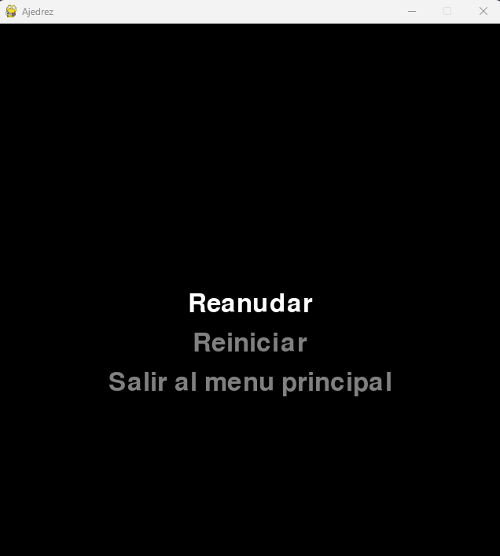

# Ajedrez en Python con Pygame

## Descripción
Este es un juego de ajedrez implementado en Python utilizando la biblioteca Pygame. Ofrece una interfaz gráfica completa donde los jugadores pueden disfrutar de una partida de ajedrez con todas las reglas básicas implementadas.

## Características
- Interfaz gráfica completa
- Sistema de turnos (blancas y negras)
- Visualización de movimientos válidos
- Menú principal y menú de pausa
- Contador de movimientos
- Piezas con gráficos personalizados

## Capturas

### Menu principal

### Menu de pausa

### Juego

## Requisitos
- Python 3.x
- Pygame

## Cómo jugar
1. Inicia el juego y selecciona "Jugar" en el menú principal
2. Las blancas mueven primero
3. Haz clic en una pieza para seleccionarla
4. Los movimientos válidos se mostrarán con círculos amarillos
5. Haz clic en un círculo amarillo para mover la pieza
6. Presiona ESC para acceder al menú de pausa

### Controles
- **Ratón**: Seleccionar y mover piezas
- **ESC**: Abrir menú de pausa
- **Flechas arriba/abajo**: Navegar por los menús
- **Enter**: Seleccionar opción en los menús

## Características técnicas
- Resolución de pantalla: 640x680 píxeles
- FPS: 60
- Tamaño del tablero: 8x8 casillas

## Funcionalidades implementadas
- Sistema completo de movimientos válidos para cada pieza
- Detección de bloqueo de camino para piezas como la torre, alfil y reina
- Movimientos especiales de peones (movimiento doble inicial)
- Sistema de turnos alternados
- Menú de pausa con opciones de reanudar, reiniciar y volver al menú principal
